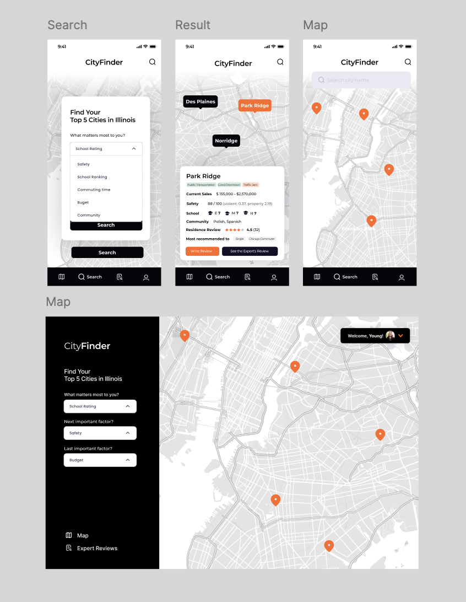

# CityFinder

## Overview
**CityFinder** is a tool designed to make the home-finding process easier. It allows users to compare cities based on current property prices, crime rates, school quality, and property value appreciation rates, enabling them to make informed decisions.

## Previews:



## Usage Instructions:

**Step 1: Fetch Data for Desired Cities**

Use my web scraping code(https://github.com/YoungSong99/city-finder-web-scraping) which is using Python's BeautifulSoup to scrape information from NeighborhoodScout.
Open the Excel file in this repository and enter the names of the cities you want to fetch data for.

**Step 2: ETL City Data**
Load the data obtained in Step 1 to the server using Pentaho Data Integration.
Run the transformations file from https://github.com/YoungSong99/city-finder-data-ETL


**Step 3: Connect Web App and Database**
Connect this web app to the database to enjoy the data on an interactive map.
1) Clone the repository:
```bash
git clone https://github.com/YoungSong99/city-finder-web-app.git
cd cityfinder
```
2) Install dependencies:

```bash
bundle install
```
3) Set up the database:
```bash
rails db:create
rails db:migrate
```
4) Run the application:
```bash
rails server
```

## Feedback
Thank you for using CityFinder! We hope it helps you find the perfect city to call home.
If you have any questions or suggestions for improvement, feel free to contact me on [LinkedIn](https://www.linkedin.com/in/youngsong-us/)
